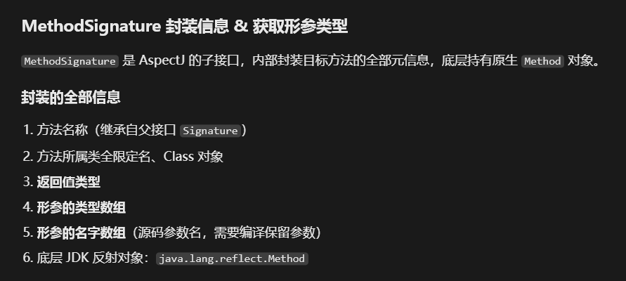

# 苍穹外卖


## 配置文件

### 什么是配置文件，为何生效

配置文件就是一些常用的外部变量，避免硬编码写到java代码里面，但又要经常用，所以写到配置文件中去。

springboot项目的配置文件有严格的命名规定：

主配置文件：application.yml/.properties/.yaml必须是application开头。主流一般选择yml配置文件。

配置文件是如何生效的？

在框架启动的时候，会自动加载所有的配置文件，把配置文件中的所有键值对全部读取到硬盘当中，存入一个名为environment的环境对象。

框架底层的各个组件要用到这些变量的时候就会调用这些配置变量。比如用@Value注解。

可是，这样写的话，如果要用到这些配置信息的地方十分多，且不集中，那么整个项目中，关于配置项的代码就十分零散，不利于维护了。所以，我们就引出了配置映射类。它可以把配置文件中的一组配置映射封装到一个类当中。

如何定义一个配置映射类？

~~~java
@ConfigurationProperties(prefix = "")
public class DemoProperties{
}
//如上，就是一个十分基础的配置映射类。但在实际项目中，不会这么简单。要把类交给IOC管理，所以要加上@Component注解，因为图中涉及到了自动映射。而自动映射底层几乎都是无参构造+set方法。所以我们还要再加@Data注解prefix表达式是指要映射的那一组配置的前面的限定说明部分。
~~~

注意：@Component注解让spring管理这个类，不仅仅是加入IOC容器这么交单，还保证了配置信息能够正常的从配置文件映射到类的指定字段上。如果不加@Component注解，就会映射失败，配置映射类的各个字段都是null。

当然，关于配置映射的方法不止这一个，配置信息也还有其它细节，详细内容参见：[跳转](./配置文件工作原理.md)

### 配置文件中的哪些是可以自定义

从历史经验我们可以知道，配置文件有一些配置我们必须按照指定的名字去写，而有一些我们又可以随意书写，只要保证见名知意即可。

那么哪些配置文件是可以随意书写，哪些是必须按照规定书写的呢？

必须按照规定写的：

spring.* / server.* / mybatis.* / logging.* / spring.redis.*

这些目录下的都是spring官方封装好了配置映射类。所以，他们的key必须按指定的写。否则报错。

具体的配置信息如下：

#### spring.*


~~~yml
spring:
  # 环境激活
  profiles:
    active: dev
  # 循环依赖
  main:
    allow‑circular‑references: true
  # 数据源
  datasource:
    url:
    username:
    password:
    driver‑class‑name:
  # 静态资源
  web:
    resources:
      static‑locations:
  # 时间格式化
  jackson:
    date‑format: yyyy‑MM‑dd HH:mm:ss
    time‑zone: GMT+8
  # 文件上传大小限制
  servlet:
    multipart:
      max‑file‑size:
      max‑request‑size:
  logging:
  level: #包日志级别 trace<debug<info<warn<error
  file: #日志输出文件路径
~~~


#### server.*

~~~~xml
server:
  port: 8080
  servlet:
    context‑path: /xxx  #项目访问根路径
  tomcat:
    max‑threads: 200

~~~~


#### mybatis.*

~~~xml
mybatis:
  mapper‑locations: classpath:mapper/*.xml
  type‑aliases‑package: com.sky.entity
  configuration:
    map‑underscore‑to‑camel‑case: true
    log‑impl: org.apache.ibatis.logging.stdout.StdOutImpl 
#打印sql

~~~


### talis中遇到的

~~~java
@Value //用于映射配置文件，但一次只能映射一个属性
@Value("${要映射的配置信息}")
private 被映射的字段类型及字段名

如：
@Value("${sky.jwt.admin-ttl}")
private Long adminTtl;
//缺点：一次只能映射一个配置信息，如果要映射多个的话就要写许多个@Value注解，适合配置少的使用。注意：这个配置类要交给IOC容器管理
//@Value("${})的大括号里面不仅可以引用配置文件的内容，还可以直接写死。
如给：
@Value("#{700000}")
private Long adminTtl;
这个字段是用来描述jwt令牌有效时间的，我就可以直接写死。注意，直接写死是用#
~~~


### 苍穹外卖

~~~
@ConfigurationProperties是org.springframework.boot.context.properties.ConfigurationProperties包下的。
这个注解会根据他的一个属性prefix去到配置文件里找相关配置并把他们映射到配置类里面。
注解@ConfigurationProperties配置文件支持松散配对，简单来说就是只要字母一样顺序一样，不管单词与单词之间是用下划线还是短横线分割的都可以直接映射到配置类的对应字段中。
@ConfigurationProperties(prefix = "sky.jwt")
public class JwtProperties{
}
和@Value注解一样，这个类也需要交给IOC容器管理

~~~


## 实体类分类

在talis阶段，实体类只是分为pojo这一个类目，而在苍穹外卖这种大型项目中，实体类由pojo分成了三类：

### dto

数据传输对象，通常是用于程序中各层之间的数据传递。

常见的是前端向后端发送一个请求，对于请求中的数据，后端会用一个dto类去接收。

### entity

实体类，通常是和数据库中的表一一对应。进行数据库操作的时候进行映射

### vo

视图对象，为前端展示数据提供的对象


## 异常复习&全局异常捕获

### 异常的抛出

如果是受检异常，在书写方法的时候，进行判断，如IO受检异常：。他在底层是这样：

~~~java
//方法定义处
void function(File file)throws FileIsNullException{
    if(file == null){
    throw new FileIsNullException();
}//这里的FileIsNullException就是一个受检异常，其实这个异常底层也是java自定义的，继承了Exception。跟我们自定义异常没有太大区别。不过这个是受检异常，必须抛出或try-catch捕获。
}
//方法调用处：
void demo()throws FileIsNullException{
    function(file);
}
~~~

受检异常必须一层一层向上抛，必须显式处理。要么在方法定义处throws要么try-catch。如：service向上抛给controller，controller向上抛给tomcat服务器，若是定义了全局异常处理类，tomcat还会把这个异常交给全局异常处理类。全局异常 处理类以一个固定的格式传递给前端。如果没有的话，tomcat就会以他的格式传递了，就很不友好优雅了。

一般的，还会把受检异常包装成一个业务异常，这样就不用强制显式处理了。controller方法调用也就不用throws了，这样可以让方法签名变得简洁，免去一大堆异常信息。

受检异常必须处理:

~~~java
处理方案1：抛给下一个人处理
void func()throws Exception{
    if(){
        throw new Exception;
    }
}
处理方案2：自己处理，try-catch捕获
try{

}catch(Exception e){
	
}
~~~


如果不是受检异常，直接在不对劲的一方throw new DemoException就行了。它会一直向上抛，直到有人处理了。

### 全局异常捕获

如何定义一个全局异常处理器：

~~~java
@RestControllerAdvice
public class GlobalExceptionHandler{
    
    @ExceptionHandler(异常字节码对象)
    public Result<String> handlerXxxxException(异常对象){
        return Result.error(e.message())
}
}

如：
@RestControllerAdvice
public class GlobalExceptionHandler{
    
    @ExceptionHandler(Exception e)
    public Result<String> handlerXxxxException(Exception e){
        return Result.error(e.message())
}
}

@RestControllerAdvice是个复合注解@ControllerAdvice + @ResponseBady
~~~

[SpringBoot全局异常捕获类.md](./SpringBoot全局异常捕获类.md)


## tomcat服务器

### tomcat反向代理配置信息

~~~yml

~~~

## md5加密

在服务器中，数据库里面的密码是以明文形式存储的，一旦发生数据泄露其后果是十分严重的，所以，我们应当对数据库中的一些敏感信息进行加密。

而md5就是一种常见的加密方式，且spring官方也对其进行了封装。

### md5介绍

md5是一种单向加密的加密方式，即只能加密不能破解。服务器接收到前端传递来的密码后对其进行md5加密，然后将其与数据库里获得的密文进行比对。

### md5的应用

spring将md5加密相关工具方法放在了 `spring-core` 模块的 `DigestUtils` 类中

~~~java
//spring官方提供的md5加密工具类
//来自import org.springframework.util.DigestUtils;
password = DigestUtils.md5DigestAsHex(password.getBytes());
~~~

## @Builder注解

### 快速感受


@Builder是lombok库的一个注解，可以自动为我们生成建造者模式的样板类代码，让我们更优雅地创建一个对象。

如：

~~~java
Student stu = Student.builder()
    .name("lihua")
    .id(10)
    .gender(1)
    .build();
~~~

### @Builder使用的注意事项

在基础使用时，我们可以直接把@Builder注解加到相对应的类上即可。Lombok会自动的为这个类生成一个全参构造和一个内部Builder类

注意：

1）使用@Builder注解后，会自动生成一个全参构造，而spring框架依赖的无参构造就失效了，这会导致mybatis，前端参数映射失败，所以我们还需要手动加上@AllArgsConstructor，@NoArgsConstructor

2）使用@Builer后，再给属性设置一个默认值就会失效，如果必须设置某一个默认值时，我们可以使用@Builder.Default写在对应属性上面就行了。

~~~java
@Data
@AllArgsConstructor
@NoArgsConstructor
@Builder
public class Student{
   @Builder.Default
   private Integer age = 18;
   private String name;
}
~~~


## Swagger测试框架

### 简介

swagger是一个网站框架，在项目中集成了之后可以在线生成API接口文档，以及测试样例，以及可以在线测试。就像apifox一样。

### 如何集成到项目中


## 公共字段自动填充

### 公共字段

每一张数据库表基本上都会有create_time,update_time等公共字段。而我们在执行update,insert语句的时候不可避免的要去修改这些公共字段的值。而且，这些代码相似度，重复度都极高。如果我们可以对此进行改进就可以极大程度上减小代码的冗余。

### AOP相关操作

这些相关操作都是在service层进行的，而service层又是在mapper层之前。如果我们在service层前切开，就太早了，可能传递给mapper的数据还没有准备好。而方法是aop的最小切割点。所以，我们把合适的mapper方法定义成切点，将其切开后进行公共字段填充的工作。

1）如何定义一个切面类

在server包下面定义一个aspect包，专门盛放切面类。切面类命名规范：XxxxAspect。如公共字段自动填充：AutoFillAspect

~~~java
//自定义切面类
@Component //把切面类交给IOC容器管理
@Aspect //声明这是一个切面类
public class AutoFillAspect{
    //定义切点还有通知
  }
//为什么要把切面类交给IOC容器管理？因为在springboot框架启动的时候，底层会扫描IOC容器里面的所有Bean对象，如果发现了有@Aspect标注的类就说明这是一个切面类。进而根据切点表达式找到目标方法，生成目标方法所在类的代理对象，并将其加入IOC容器，在后期DI注入的时候，直接注入代理对象。通过代理对象调用方法。
~~~

2）如何定义一个切点及通知

原先我们在定义切点及方法的时候是将其写在一起的，这样也可以，但复杂一点的代码还是建议分开写。

写在一起的：

~~~java
都是以环绕通知为例：
@Around(execution("切点表达式"))
public Object demoFunction(ProceedingJoinPoint pjp)
    
@Around("@annoation(自定义注解全类名)")
public Object demoFunction(ProceedingJoinPoint pjp)
~~~


分开写的：

~~~java
//定义切点
@Pointcut("execution(切点表达式) && @annotation(自定义注解全类名)")
public void demoPointCut(){}

//写通知
@Around("demoPointCut()")//相当于是调用了标有@Pointcut注解的方法
public Object demoFunction(ProceedingJoinPoint pjp){
    
}
~~~

### 自定义注解

1）注意到前面我们在写切点的都是都用到了自定义注解。所以接下来，我们复习一下如何自定义一个注解：

和定义接口，类一样的操作。我们一般会在server包下面创建一个annotation包，里面专门盛放项目需要的注解。

2）元注解，元注解就是修饰注解的注解。常用的有两个：

@Target(ElementType.METHOD)

@Retention(RetentionPolicy.RUNTIME)

从我们过去的代码经验可以知道，注解大都是有属性的。而这里，我们也想要让自己的注解有属性。因为注解标记的方法会被aop拦截，我们可以获得这个方法的签名，却无法知道这个mapper层方法到底执行的是update语句还是insert语句，从而我们就无法判断是只修改update相关字段还是连insert字段一起修改了。而给注解添加一个属性值就可以很好的解决这个问题。我们手动给注解写好要执行的是insert还是update。

3）要给自定义注解添加属性，最基本标准的方法是，在注解里面写一个无参不实现方法。而方法的返回值类型就是注解的属性值类型。

~~~java
@Target(ElementType.MENTHID)
@Retention(RetentionPolicy.RUNTIME)
public @interface Demo{
    DemoEnum valus();
}
~~~

4）什么是枚举：

枚举就是一组预定义的常量对象。

~~~java
public enum DemoEnum{
    INSERT,
    UPDATE
}
这是我们代码编写的，而编译器会把她变成：
public final class Demo extends Enum{
	public static final Demo INSERT = new Demo();
	public static final Demo UPDATE = new Demo();
}

//Demo.INSERT是一个对象引用
注解属性类型是枚举时，赋的值必须是这个枚举的某个实例。其实这也是必然的，因为底层编译器自动把他封装成了一个对象。
~~~


### JoinPoint对象以及反射

在通知中，除了环绕通知，其他几种通知的形参都是JoinPoint，而且，环绕通知的形参ProceedingJoinPoint。

1）JoinPoint与ProceedingJoinPoint的区别

JoinPoint是ProceedingJoinPoint的父接口，后者有前者所有的方法，而且还有拓展方法。

JoinPoint不是必须写的，可写可不写。而ProceedingJoinPoint是环绕通知特有的，且必须写。

JoinPoint封装的内容：

| 方法                  | 作用                                 | 返回值           |
| --------------------- | ------------------------------------ | ---------------- |
| `getSignature()`      | 获取连接点签名对象（方法 / 构造器）  | `Signature`      |
| `getArgs()`           | 获取调用时传入的**实际参数值**       | `Object[]`       |
| `getTarget()`         | 获取**目标对象**（被代理的原始对象） | `Object`         |
| `getThis()`           | 获取**AOP 代理对象本身**             | `Object`         |
| `getKind()`           | 连接点类型，例如`method‑execution`   | `String`         |
| `getSourceLocation()` | 源码位置（类、行号）                 | `SourceLocation` |
| `getStaticPart()`     | 静态部分，不包含运行时数据           | `StaticPart`     |

其他没用到的了解一些即可，知道有这么回事，下次见到了不至于十分陌生。

本项目里面用到的是获取调用时传入的实际参数值：getArgs()

上面已经说了，ProceedingJoinPoint是JoinPoint的子类，有自己的拓展方法，而其中最常用的就是proceed方法。

Object proceed() throws Throwable{}

2）如何获取方法签名

**在javase中，方法的签名包括方法名和方法的形参类型列表。不包括**返回值类型，注解，修饰符，异常等。

众所周知，java是一门面向对象语言，在面向对象这种变成思想看来，万事万物都是一个对象。方法签名当然也在其中了。

在java底层，专门为其封装了一个类Method，方法签名。而通过方法签名我们可以做许多许多事。如，获取方法名，方法形参类型列表，方法异常情况，方法的修饰符等。这里我们不一一举例，**只讲最重要的：根据方法签名获取注解对象。**

~~~java
Method m = ...;

// 常用API速查
m.getName();                    // 方法名
m.getReturnType();              // 返回值类型
m.getParameterTypes();          // 参数类型数组
m.getParameterCount();          // 参数个数
m.getModifiers();               // 修饰符位掩码
m.getAnnotation(Class);         // 获取指定注解
m.getAnnotations();             // 获取所有注解
m.getDeclaringClass();          // 所属类
m.getExceptionTypes();          // 异常类型数组
m.getGenericReturnType();       // 带泛型的返回值类型
m.getParameters();              // 参数对象数组（可获取参数名）
m.invoke(obj, args);            // 执行方法（最核心）
~~~


获取方法签名的方式有：

通过字节码对象：clazz.getMethod("方法名", 参数形参列表);

以及在苍穹外卖中获取签名的方式：

~~~java
//通过字节码对象获取方法签名,这里的形参类型列表是一个可变参数，可以写一个可以写多个。也可以不写。中间以逗号分隔。
Method demoMethod = clazz.getMethod("demoFunction", DemoParamStyle)
 //本项目中通过MethodSignature对象获取方法签名。
Method method = MethodSignature.getMethod();
~~~

苍穹外卖项目代码：

~~~java
@Pointcut("")
public void autoFillPointcut(){}

@Before("autoFillPointcut()")
public void aufill(JoinPoint joinPoint){
    MethodSignature methodSignature =（MethodSignature）joinPoint.getSignature()
        Method method = methodSignature.getMethod();
}
~~~

为什么苍穹外卖项目中要用MethodSignature，进而获得方法签名对象？

aop不仅可以拦截普通方法，还可以拦截构造器。而aop底层并不知道你要拦截的是普通方法还是构造器方法，所以创建了一个通用接口Signature接口对象。直接用方法getSignature()。也不用判断也不能判断，到底你拦截的是普通方法还是构造器。

而MethodSignature就是Signature接口的实现类之一。所以我们如果通过joinPoint.getSignature()方法获得的就是这个接口对象，而我们还需要对其进行强转，转成MethodSignature

MethodSignature和Method的关系，为什么前者可以通过getMethod方法获取到后者。这是因为，`MethodSignature`内部持有了一个`Method`对象引用，调用`getMethod()`就是把这个持有的原生 Method 返回出来

既然MethodSignature底层封装了Method相关的内容，那有没有封装注解相关的？MethodSignature具体封装大全：



由此可见，MethodSignature底层并没有封装方法注解相关内容。但这里也有我们本项目可以用到的：

第6个：底层JDK反射对象：java.lang.reflect.Method，即获取方法签名。

3）利用反射给公共字段赋值

在上面我们已经知道了，可以通过JoinPoint获得Signature接口对象，将其强转成MethodSignature对象后，即可获得真正的方法签名Method对象。进而通过方法签名获得被拦截方法的注解的属性值，进而判断，本次拦截的mapper方法的sql语句到底是update类型还是insert类型。

如何通过方法签名获得注解相关信息呢？通过方法签名我们到底可以获得哪些信息？

可以获取注解相关信息，可以调用方法。

a. 获取注解相关信息：

```
// 获取本方法上该注解（直接标注，不继承）
<T extends Annotation> T getAnnotation(Class<T> annotationClass);

Annotation[] getDeclaredAnnotations();   // 所有直接注解
boolean isAnnotationPresent(Class<? extends Annotation> ann); // 是否存在注解
```

本项目的代码：

~~~java
//获取方法的注解对象
Autofill autofill = method.getAnnotation(Autofill.class);
~~~

注解本身就是一种特殊类型的接口，被@interface修饰，使用@应用在代码元素上时，运行时通过反射机制可以将其视为对象来获取和操作。

通过注解获取其属性值的方法：

注解的属性值，在定义的时候是一个空参不实现的方法，方法的返回值类型就是注解值的数据类型。我们可以通过注解对象调用这个空参方法，就可以获得注解的属性值：

OperationTypeEnum operationTypeEnum = autofill.valus()
获取到属性值后我们就可以对拦截到的方法进行判断了。到底是insert还是update

b. 接下来我们就要根据sql类型为公共字段赋值了：

前面，我们已经通过JoinPoint的相关方法：获取到被拦截方法的具体形参对象了。

`getArgs()`  获取调用时传入的**实际参数值**  `Object[]`

~~~java
Object[] entities = joinPoint.getArgs()
//获取到的是一个数组，直接取第一个索引就行了。
Object entity = entities[0];
//entity就是那个实体对象了。
~~~

获取到实体对象，我们就可以反射获取相关方法的签名，进而调用相关方法：

~~~java
Class entityClazz = entity.getClass();//获取实体对象的字节码对象

Method setUpdateTimeMeyhod = entityClazz.getMethod(String methodName, Class<?> ... parameterTypes)throws NoSuchMethodException；//获取指定方法方法签名。
//第一个参数是方法名字符串，第二个参数是方法形参类型的字节码对象，是可变参数
//getMethod只能获取public方法，也包含父类的public
//getDeclaredMethod可以无视权限，但只能获得本类的，不能获取父类的。

~~~

获取到实体类的对象seter方法的方法签名后，我们就可以通过反射调用。来进行反射赋值了。

~~~java 
// obj：调用哪个对象；args入参；静态方法obj传null

Object invoke(Object obj, Object... args) throws IllegalAccessException, InvocationTargetException;

~~~

苍穹外卖项目代码：

~~~java
setUpdateTimeMethod.invoke(entity, updateTime);
//如果害怕这个方法有可能是private，我们还可以加上一个无视权限：
functionDemo.setAccessible(true);
~~~

## 配置类详解

### 什么是配置类

配置类不需要额外实现任何接口，只需要类的定义上加一个注解@Configuration.加了这个注解之后就是配置类了。

springboot的启动流程：

spring扫描所有被@Configuration/@Com[pnent注解标记类，把配置类本身先注册为IOC容器里面的bean

spring内部还有一个专门解析配置类的处理器，他可以扫描配置类中所有加了@Bean的方法，得到返回对象，将其交给IOC管理。

### 为什么有的配置类实现了接口

在以前，我们写拦截器的时候，需要在配置类里面注册，这需要给配置类实现一个接口`WebMvcConfigurer`

这是为什么呢？

如果一个配置类只是为了引入第三方Bean对象就不需要实现任何接口，继承任何方法，只需要给配置类加上一个@Configuration注解就够了。

如果一个配置类想要springMVC在初始化的时候，能够回调我写的方法，做自定义拓展，就需要让配置类额外实现一个接口或继承一个抽象类了。

实现的接口：`WebMvcConfigurer`

我们注册的拦截器，管理时间格式的类，都会被springMVC加载，并交给IOC容器管理，spring官方提供的也会被springMVC加载，交给IOC容器。这说明如果我们实现WebMvcConfigurer接口的话，一些如拦截器的方法是会叠加生效的。

继承的抽象类：`WebMvcConfigurationSupport`

如果选择继承抽象类WebMvcConfigurationSupport效果就和webMvcConfigurer完全不一样了，springMVC不会加载抽象类的默认实现，只会加载我们重写后的。它不是叠加生效的。

### 如何做自定义拓展

在给springMVC框架做自定义拓展的时候，无论配置类是实现接口还是继承抽象类。我们都只要做一件事：想办法知道springMVC为我们留下的相对应的钩子会小方法。然后我们去重写这个方法。要做到这一点，我们首先就要知道，我们要做的拓展的对应的钩子方法是哪个？

重写相对应的钩子方法后，框架会把框架内部现成的对象传递给我，我只需要操作这个参数即可。

1）如：我想要定义一个自定义的拦截器。

我首先要知道springMVC框架为此预留的钩子方法是哪个，我好重写。查询资料后之后了，我要重写addInterceptors方法。

`protected void addInterceptors(InterceptorRegistry registry)`

重写之后，发现他把框架内部现成的对象也传递给我了。且查询资料后，也大概了解，要把我自己写的拦截器，交给框架传递过来的这个参数。

那就在配置类里面搞一个我自己写的拦截器对象，并把它交给registry。

到此就完成了拦截器的自定义拓展。

注意：这其中就要求自己可以通过查文档了解如何自定义一个拦截器。

2）消息转换器也是一样。

~~~java
@Configuration
public class WebMvcConfiguration extends WebMvcConfigurationSupport {

    /**
     * 扩展Spring MVC框架的消息转化器，用于统一处理后端返回给前端的日期时间格式
     * @param converters 消息转换器列表
     */
    @Override
    protected void extendMessageConverters(List<HttpMessageConverter<?>> converters) {
        //和上面一样，我们可以大概猜出，springMVC是要我们把我们自定义的消息转换器交给List容器管理，且也知道我们要创建的是一个和HttpMessageConverter有关系的对象。
        log.info("扩展消息转换器...");
        // 1. 创建一个消息转换器对象
        MappingJackson2HttpMessageConverter converter = new MappingJackson2HttpMessageConverter();
        // 2. 为消息转换器设置一个自定义的对象映射器（ObjectMapper）
        converter.setObjectMapper(new JacksonObjectMapper());
        // 3. 将自定义的转换器放到容器中的第一个位置（优先级最高）
        converters.add(0, converter);
    }
}
~~~


3）设置静态资源映射

~~~java
protected void addResourceHandlers(ResourceHandlerRegistry registry) {
        registry.addResourceHandler("/doc.html").addResourceLocations("classpath:/META-INF/resources/");
        registry.addResourceHandler("/webjars/**").addResourceLocations("classpath:/META-INF/resources/webjars/");
    }
~~~


文件上传的细节。

Bean对象不是默认单例的吗？为什么在给IOC容器引入自己写的Bean对象的时候还要加上@ConditionalOnMissingBean注解？

## 配套更深入

10.1配置类中 @Bean 方法为什么会自动执行，对象放进 IOC 容器？

`@Configuration`标记的类会被 Spring 识别为**配置类**。SpringBoot 启动流程：

1. Spring 扫描所有被`@Configuration / @Component`的类，把配置类本身先注册为 IOC 中的 Bean。

2. Spring 内部有一个`ConfigurationClassPostProcessor`**配置类后置处理器**（非常核心，BeanFactory 后置处理器）。

3. 这个处理器专门解析

   ```
   @Configuration
   ```

   类：

   - 扫描类中所有加了`@Bean`的方法
   - **自动调用这个@Bean修饰的方法**，得到返回对象
   - 将返回对象注册到 IOC 容器，beanId 默认是**方法名**

> ⚠️注意：不是 JVM 自动调用，是**Spring 框架的后置处理器主动反射调用你的 @Bean 方法**，不是 main 方法执行。

### Full 模式与 Lite 模式回顾（和这个流程挂钩）

1. `@Configuration`（默认`proxyBeanMethods=true` Full 模式）配置类会生成 CGLIB 代理子类。如果配置类内部，一个`@Bean`方法调用另一个`@Bean()`方法，不会重复执行方法，直接从容器拿单例。
2. `@Configuration(proxyBeanMethods=false)` Lite 模式：**不生成代理**，后置处理器依旧会调用`@Bean`方法注册 Bean；但是代码里手动调用本类`@Bean`方法，会直接执行方法，产生新对象。

> 关键点：**不管 Full 还是 Lite，Spring 的ConfigurationClassPostProcessor都会找到所有 @Bean 方法，自动执行，把返回对象放入 IOC。代理只影响「配置类内部互相调用」，不影响 Spring 框架调用。**